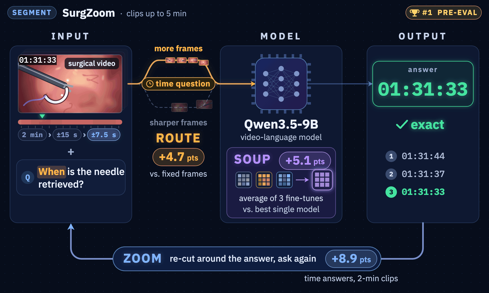

<div align="center">

# 🔍 SurgZoom

### Question-Guided Temporal Focusing for Surgical Video Question Answering

**Our solution to the SEGMENT track of the [ORena SAVE FOCUS Challenge](https://orena-focus-challenge.org/), MICCAI 2026**

[](https://huggingface.co/wxyi088/orena-SurgZoom)
[](https://huggingface.co/datasets/orena-dkfz/heico-focus-vqa)
[](https://huggingface.co/datasets/orena-dkfz/lapchole-focus-vqa)
[](https://huggingface.co/Qwen/Qwen3.5-9B)
[](LICENSE)

</div>

<p align="center"></p>

SurgZoom answers questions about foreign objects (sponges, needles, clips, specimen bags) in
surgical video clips of up to five minutes. It fine-tunes
[Qwen3.5-9B](https://huggingface.co/Qwen/Qwen3.5-9B) with LoRA and lets the question decide
where the model looks:

- **Route.** Every question gets 20,480 visual tokens: timestamp and counting questions spend
  them on 256 frames, all others on 128 sharper frames (+4.7 points over fixed 64-frame
  sampling). A question that names a time is answered on a window around it.
- **Soup.** One adapter, averaged from three fine-tunes trained with different input regimes
  (+5.1 points over the best single fine-tune).
- **Zoom.** A timestamp answer is re-asked on ±15 s and ±7.5 s re-cuts around it
  (+8.9 points on timestamps in 2-min clips).

## 📰 News

- **2026-09** Code and weights of our SEGMENT-track solution are released.

## 📊 Results

| | Pre-evaluation | In-distribution | Out-of-distribution |
|---|:-:|:-:|:-:|
| **SurgZoom** | **0.6346** | 0.6515 | 0.6176 |

Ablation on the public HeiCo and LapChole test splits (6,254 questions):

| | Score |
|---|:-:|
| Best single fine-tune | 0.7292 |
| Weight-averaged adapter | 0.7797 |
| + temporal zoom (SurgZoom) | **0.7920** |

## 🚀 Quickstart

One NVIDIA GPU with ≥ 48 GB and PyTorch ≥ 2.9 (CUDA). Request access to
[HeiCo-FOCUS-VQA](https://huggingface.co/datasets/orena-dkfz/heico-focus-vqa) and
[LapChole-FOCUS-VQA](https://huggingface.co/datasets/orena-dkfz/lapchole-focus-vqa) on the Hub first.

```bash
git clone https://github.com/wxyi057/orena-SurgZoom && cd orena-SurgZoom
pip install -e ".[eval]"
hf auth login                            # once your access requests are approved
python tools/make_examples.py            # 2 HeiCo + 2 LapChole test questions -> examples/demo
python -m surgzoom.infer --input examples/demo --output answers.json
python tools/evaluate.py --answers answers.json --reference examples/demo/reference.json --judge none
```

```
qID        branch frames  window           passes -> answer
2295666    time      256  6338-6581 s      01:47:58 | 01:48:10 | 01:48:10 -> 01:48:10
2362897    count     256  whole clip       3 -> 3
1725068    time      256  whole clip       00:16:13 | 00:16:08 | 00:16:08 -> 00:16:08
1713930    other     128  1382-1448 s      Clip, Specimen -> Clip, Specimen
```

All four match the ground truth; on both timestamp questions the zoom corrects the first answer.

In Python:

```python
from surgzoom.pipeline import SurgZoom

model = SurgZoom()                        # Qwen/Qwen3.5-9B + wxyi088/orena-SurgZoom
answers, traces = model.answer(requests,  # same format as examples/demo/request.json
                               clip_dir="examples/demo/overlayed",
                               fo_definitions=open("configs/FO_definitions.txt").read())
```

## 🏋️ Training

```bash
# 1. challenge-format clips from the official HeiCo-FOCUS-VQA and LapChole-FOCUS-VQA data
for d in heico lapchole; do
  hf download orena-dkfz/$d-focus-vqa --repo-type dataset --local-dir data/$d-focus-vqa
  python tools/prepare_data.py --data-root data/$d-focus-vqa --name $d
done

# 2. one LoRA run per input regime (1, 2, 3)
python tools/build_sft_data.py --regime 3 \
    --data-root data/heico-focus-vqa --clips data/clips/heico \
    --data-root data/lapchole-focus-vqa --clips data/clips/lapchole --out data/sft/regime3.jsonl
REGIME=3 NPROC_PER_NODE=4 bash scripts/train.sh data/sft/regime3.jsonl runs/regime3

# 3. average the best checkpoint of each regime
python tools/make_soup.py --adapters <regime3-ckpt> <regime2-ckpt> <regime1-ckpt> --out runs/soup
```

Recipe and regimes: [docs/TRAINING.md](docs/TRAINING.md). Method: [docs/METHOD.md](docs/METHOD.md).
Challenge Docker image: [challenge/](challenge/).

## 📁 Repository

```
surgzoom/     router, anchored windows, prompt, zoom, pipeline, CLI
tools/        examples, data preparation, training data, weight averaging, evaluation
scripts/      training launcher
configs/      per-regime video settings, object-class definitions
challenge/    submitted container: inference.py, Dockerfile
tests/        unit tests, parity with the submitted container
```

## 📝 Citation

```bibtex
@misc{surgzoom2026,
  title  = {SurgZoom: Question-Guided Temporal Focusing for Surgical Video Question Answering},
  author = {Yi, Weixi and Zhang, Hanyuan and He, Runlong},
  year   = {2026},
  note   = {Solution to the SEGMENT track, ORena SAVE FOCUS Challenge, MICCAI 2026},
  url    = {https://github.com/wxyi057/orena-SurgZoom}
}
```

## 🙏 Acknowledgements

We thank the [ORena SAVE FOCUS](https://orena-focus-challenge.org/) organisers (DKFZ) for the
HeiCo-FOCUS-VQA and LapChole-FOCUS-VQA datasets, the
[`orena-focus`](https://github.com/IMSY-DKFZ/orena-focus) toolkit, the Qwen team, and the
[ms-swift](https://github.com/modelscope/ms-swift) developers.
Compute was provided by Isambard-AI.

## ⚖️ License

Code: [Apache 2.0](LICENSE). Weights: CC BY-NC-SA 4.0.
