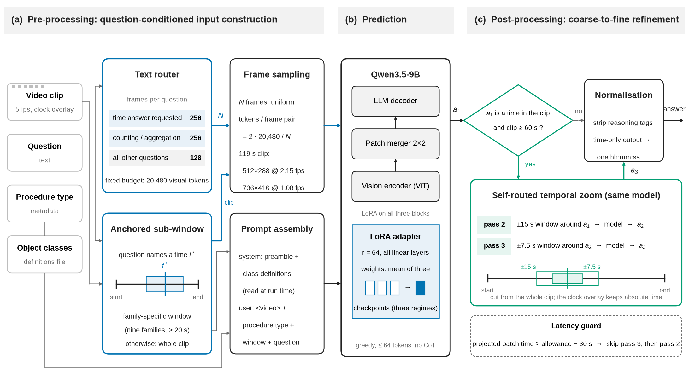
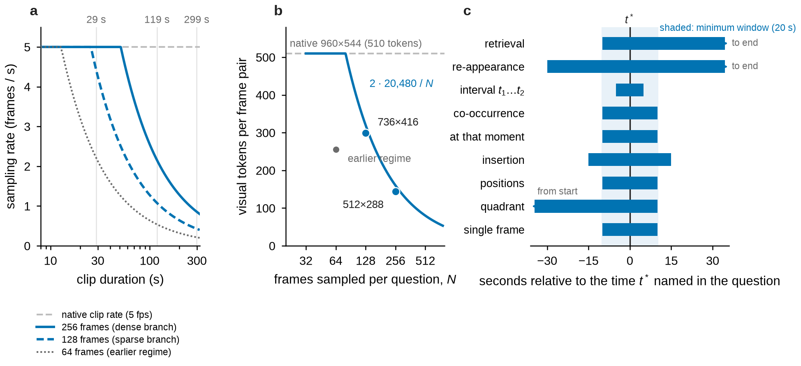
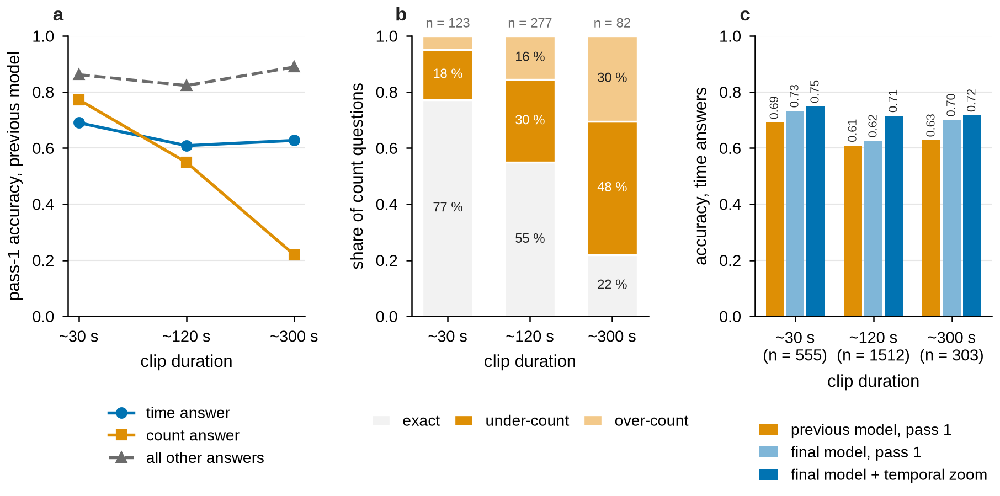

# Method

SurgZoom is Qwen3.5-9B with a LoRA adapter and four components, all driven by the question
text. Clips are up to 5 min long, at 5 frames/s, with the source-video time burned into
every frame.

<p align="center"></p>

<p align="center"></p>

**Frame budgeting** (`surgzoom/policy.py`). Every question gets 20,480 visual tokens. A text
router gives 256 frames to timestamp and counting questions and 128 to all others; the image
processor spreads the budget over the frames. On a 119 s clip that is 512×288 at 2.15 fps
versus 736×416 at 1.08 fps (panels a, b). Short clips are seen at their native 5 fps.

**Anchored sub-windows** (`surgzoom/anchor.py`). For a question that names a time t\*, the
clip is re-cut around t\* with a window per question family, e.g. retrieval
[t\* − 10 s, end], insertion t\* ± 15 s, first-occurrence quadrant [start, t\* + 10 s]
(panel c). The cut keeps the burned-in clock, and training uses the same windows.

**Temporal zoom** (`surgzoom/zoom.py`). If the first answer is a timestamp inside a clip of
at least 60 s, the model answers again on a ±15 s and then a ±7.5 s re-cut, back at the
native 5 fps. On the public HeiCo and LapChole test splits this lifts timestamp accuracy on 120 s clips from
0.625 to 0.714.

**Weight averaging** (`tools/make_soup.py`). The adapter is the mean of three checkpoints
trained with 64 frames per question, a two-branch router, and the final three-branch router
with anchored windows. The average scores 0.7797 against 0.7292 for the best single
checkpoint.

## Why

<p align="center"></p>

Timestamp and counting accuracy fall with clip length while other answers do not, and
long-clip counting errors are mostly under-counts: the model misses events between sampled
frames.

## Prompt

```
system: You are a surgical assistant. You are given endoscopic video from a minimally
        invasive procedure. Analyze the footage and answer the surgical question based
        on the visual evidence. Be precise and concise.

        {object-class definitions}

user:   <video>Procedure type: {procedure_type}.
        Clip window: {HH:MM:SS start} - {HH:MM:SS end} (source-video timeline).
        {question}
```

Greedy decoding, at most 64 new tokens, no chain-of-thought.
